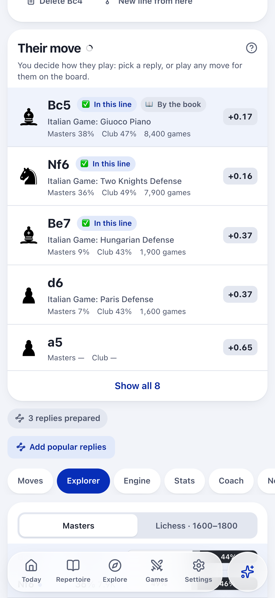
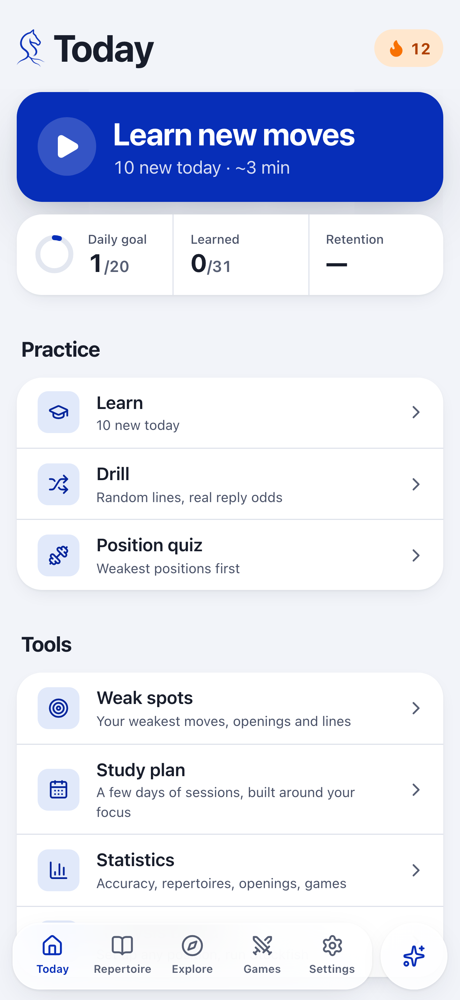
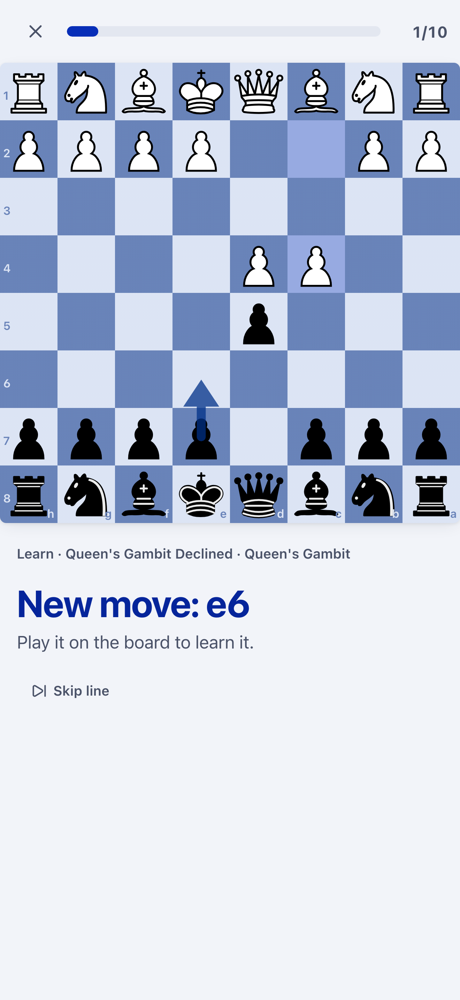
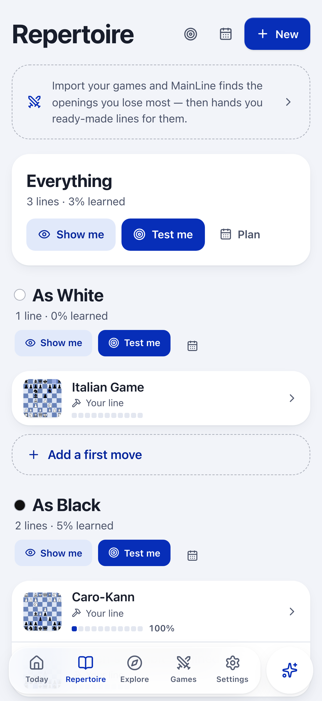
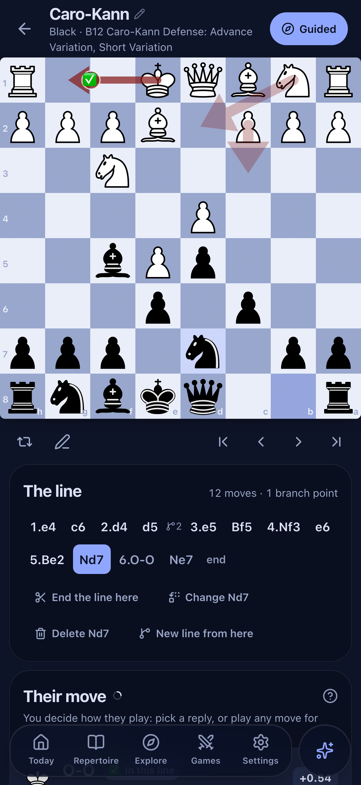

# MainLine

A chess opening trainer for the web, iPhone, iPad, Android and desktop. You build a repertoire, learn it move by move, and spaced repetition keeps it fresh.

  
  
  
  
  

## What it does

- **Build.** Play moves on the board or import PGN. Every position shows how often each move is played at your rating and how it scores, from Lichess and master games; Stockfish runs on your device.
- **Remember.** Spaced repetition (FSRS) schedules each position right before you would forget it. Learn, review, drill whole lines, or quiz your weakest positions.
- **Learn from your games.** Import your Lichess or Chess.com games and see where each one left your prep. Forgotten moves go straight back into review.
- **Understand.** Ask the coach why a move is played; explanations are checked against the position.
- **Yours.** Works fully offline, no account needed, no ads, no tracking. Sign in with Lichess (or Apple on iPhone and iPad) to sync between devices.

## Get it

- **Web:** https://api-production-8afb.up.railway.app (installs as an app from the browser).
- **iPhone and iPad, Android:** in testing on TestFlight and Google Play; store links follow when they are live.
- **Desktop:** a Tauri app for macOS, Windows and Linux lives in `apps/desktop`; no packaged release is published yet.

[Privacy policy](https://api-production-8afb.up.railway.app/privacy) · [Terms of use](https://api-production-8afb.up.railway.app/terms) · [Cookies](https://api-production-8afb.up.railway.app/cookies) · [Accessibility](https://api-production-8afb.up.railway.app/accessibility) · [Report a problem](https://github.com/Tony11-dot/mainline/issues)

## Licence

- **Code:** GPL-3.0-or-later (see `LICENSE`). The board (chessground), the rules library (chessops) and the engine (Stockfish) are GPL-3.0, so MainLine is too. Anyone who distributes a modified copy must publish their source under the same licence.
- **Name and artwork:** "MainLine", the MainLine logo, the app icon and the store artwork (`brand/`, `apps/mobile/store/`) are **not** covered by the GPL. All rights are reserved. Forks must use a different name and icon.
- **Cabinet Grotesk:** © Indian Type Foundry, under the ITF Free Font License.

## Development

See `PLAN.md` (architecture), `PROGRESS.md` (history) and `apps/mobile/store/RELEASING.md` (releases).
